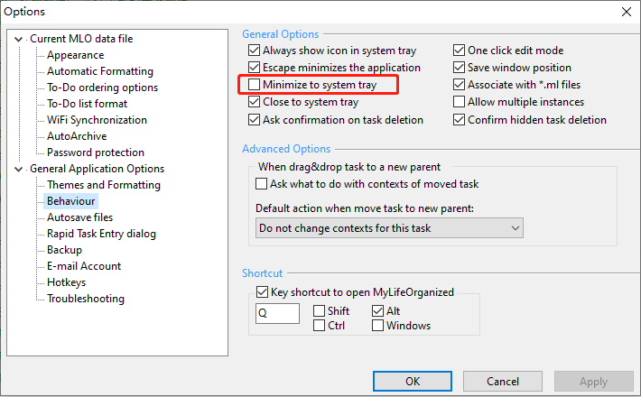

# AutoSyncMLO
一个AutoHotkey的脚本用于自动执行MLO同步操作

## 如何使用
下载并安装 [AutoHotkey](https://www.autohotkey.com/) v1.1 版本

编辑脚本 AutoSyncMLO.ahk

有四处的 `lee.ml - MyLifeOrganized` 修改成自己的标题。打开 mlo 界面，你可以在软件标题栏看到这个标题。

有一处的 `C:\Program Files (x86)\MyLifeOrganized.net\MLO\mlo.exe` 修改成自己的软件路径

有一处的 `Sleep 60000`，是脚本的执行频率（单位毫秒），这里设置的是每隔1分钟执行一次，你可以根据需要进行修改。

修改完，保存脚本运行即可。

**注意** 这个脚本的原理是检测窗口是否存在，如果存在就会发送 F9 给 mlo 来执行同步操作，所以必须让 mlo 留在任务栏，可以最小化到任务栏（但是不能最小化到系统托盘：从任务栏中消失）

因此，你需要确保没有勾选这个设置

Options - General Application Options - Behaviour - Minimize to system tray

你可以参考我的设置

这样当你按下快捷键或者 esc 的时候，程序会自动最小化到任务栏。